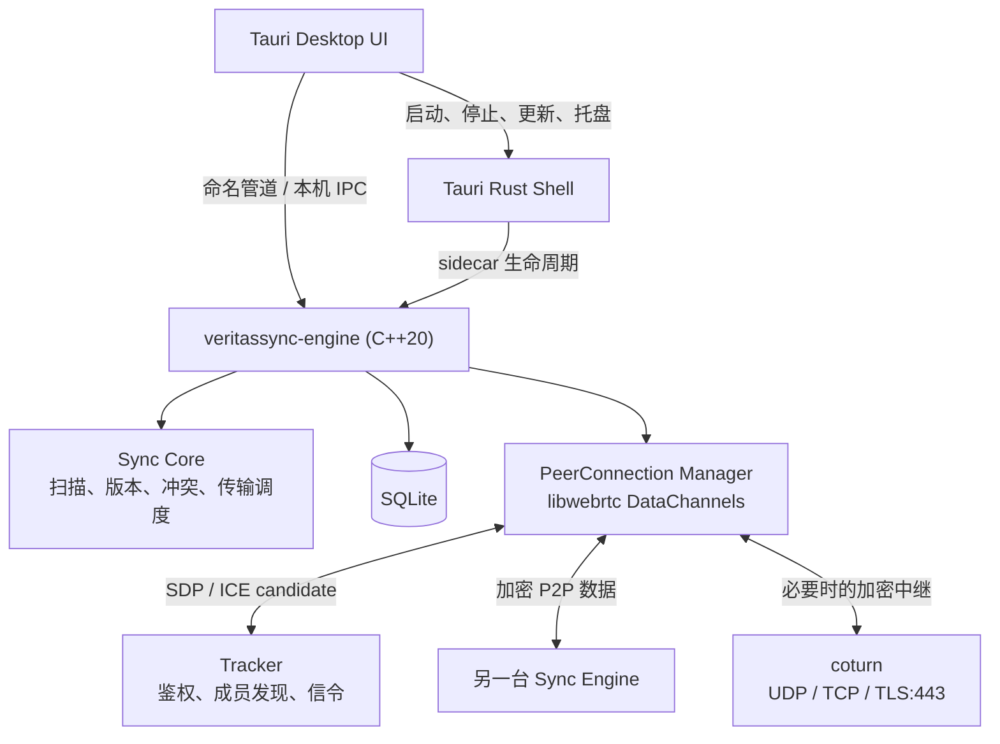
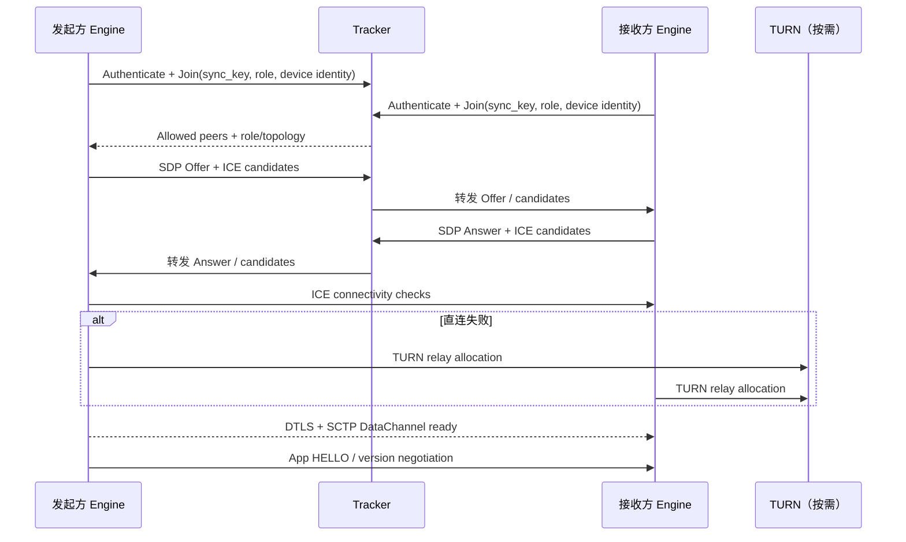

# VeritasSync 从零实现方案

> 版本：1.0
>
> 定位：桌面端、去中心化数据通路的文件同步工具。
> 支持的同步拓扑仅限：
>
> 1. **单权威源 → 多目标**（一台 Source，多个 Target）；
> 2. **两节点双向**（恰好两个 Peer）。
>
> 本方案不承诺、也不实现任意数量节点同时写入的多主同步。

---

## 1. 目标与边界

### 1.1 产品目标

- 多台设备通过相同 `sync_key` 加入同一同步组。
- 支持局域网直连、互联网 NAT 穿透，以及 TURN 中继兜底。
- 文件内容在传输链路上加密；同步组成员须经过身份与权限校验。
- 支持大文件分块、断点续传、重连恢复、删除同步、忽略规则和冲突副本。
- 提供桌面控制台、系统托盘、日志和可观察的传输状态。
- 数据通路为点对点；中心服务不存储用户文件。

### 1.2 明确不做的事

- 不支持三个及以上节点的任意双向写入。
- 不实现 CRDT、向量时钟合并、目录级分布式事务或全局一致性。
- 不以浏览器互通、音视频、屏幕共享为目标。
- 不把 Tracker 当作文件中转服务；只有 TURN 在无法直连时中继加密报文。

### 1.3 为什么限制拓扑

文件同步的真正难点不是传输，而是“同时修改同一对象后谁是正确版本”。

- 单权威源模式中，Source 是唯一真相，Target 永远不向上游回写；没有写写冲突。
- 两节点双向中，冲突只可能出现在 A 与 B 之间，可以采用可预测的二选一规则和冲突副本。
- 多主模式需要每个对象的因果关系、删除墓碑、离线修改合并、成员变更和长期垃圾回收；这是一条独立产品线，不能由“两节点冲突规则”自然扩展得到。

---

## 2. 技术选型

| 层级 | 选择 | 理由 |
|---|---|---|
| 同步引擎 | C++20 | 文件系统、哈希、SQLite 与 libwebrtc 原生 C++ API 集成直接；可控制内存、线程与 I/O。 |
| P2P 传输 | 官方 libwebrtc 的 `PeerConnection` + `DataChannel` | 复用成熟的 ICE、STUN/TURN、DTLS、SCTP、拥塞控制、网络切换和统计能力。 |
| 信令 / 成员发现 | 独立 Tracker 服务，建议 Go 或 Rust | 只处理鉴权、房间成员与 SDP/ICE candidate 转发；水平扩展简单。 |
| TURN 中继 | coturn | 独立部署，提供 UDP、TCP 和 TLS:443 兜底。 |
| 本地状态 | SQLite（WAL） | 可恢复的文件清单、分块位图、版本元数据和任务状态。 |
| 文件监听 | efsw 或平台原生 watcher 封装 | 监听仅触发增量扫描；定期全量校验避免漏事件。 |
| 内容哈希 | BLAKE3 | 速度高，适合文件指纹、块校验与去重索引。 |
| 桌面 UI | Tauri 2 + TypeScript 前端（推荐） | 窗口、托盘、安装包、更新与现代 UI；通过 sidecar 管理 C++ 引擎。 |
| 引擎与 UI IPC | 本机命名管道优先，loopback HTTP 备选 | 命名管道不占端口、权限边界更清晰；HTTP 便于调试和可选 Web 控制台。 |

### 2.1 为什么使用 libwebrtc 而不是 ICE + KCP 自研组合

从零开始时，最昂贵和最容易出错的是复杂网络中的连接建立：候选收集、连通性检查、NAT 类型差异、TURN/TLS、ICE restart、DTLS 指纹、拥塞控制和路径变化。libwebrtc 已长期承担这些工作。

文件传输使用可靠 DataChannel（其下层为 SCTP）即可。**不要在 DataChannel 内再叠加 KCP**：两层都重传、确认和排队，会增加延迟、内存与拥塞误判。

### 2.2 libwebrtc 使用范围

需要：

- `PeerConnectionFactory`、`PeerConnection`；
- ICE（STUN/TURN，含 TCP/TLS 中继）；
- DTLS；
- SCTP DataChannel；
- 网络统计和 ICE restart。

不需要：

- 音视频采集、编解码、RTP 媒体轨道；
- 应用层 KCP；
- 自行实现 STUN、TURN、DTLS、SDP parser。

构建时应使用数据通道优先、无媒体轨道的配置，避免把音视频能力作为产品依赖。仍须固定 libwebrtc 提交版本，并在 CI 中统一构建产物；不要依赖其内部、未承诺稳定的头文件。

---

## 3. 总体架构



### 3.1 进程职责

#### C++ 引擎

- 独立、无 UI 地运行，支持 `--headless`；
- 管理本地任务、文件系统、数据库、PeerConnection 和同步状态；
- 崩溃后可由 Tauri 或系统服务重启；
- 对 UI 暴露只读状态流与受控命令。

#### Tauri UI

- 任务创建、状态展示、冲突提示、日志查看、设置和目录选择；
- 管理窗口、托盘、开机启动、升级与引擎 sidecar 生命周期；
- 不直接拥有同步业务状态，不直接访问任意同步目录；
- 仅调用显式授权的 IPC 命令。

#### Tracker

- 按 `sync_key` 管理逻辑房间；
- 校验设备身份与成员角色；
- 转发 Offer、Answer、ICE candidate、ICE restart 请求；
- 不解析、不存储、不转发文件块。

#### TURN

- 使用短期、受签名的 TURN 凭证；
- 仅在直连不可用时转发 DTLS/SCTP 加密流量；
- 负责速率限制、带宽统计和滥用防护。

---

## 4. 同步模型

### 4.1 角色与权限

| 模式 | 成员 | 权限 |
|---|---|---|
| 单权威源 → 多目标 | 1 个 `source`，N 个 `target` | Source 可写；Target 只应用 Source 的快照和增量，禁止向 Source 广播本地变更。 |
| 两节点双向 | 2 个 `peer` | 两者均可写；每个文件版本由确定性规则裁决。 |

Tracker 在注册时验证角色和成员数：

- one-way 房间只允许一个 Source；
- bidirectional 房间只允许两个 Peer；
- 超出限制时拒绝接入，而不是“尽量同步”。

### 4.2 文件身份与版本

每个逻辑路径维护一条 `FileRecord`：

```text
task_id
relative_path
kind: file | directory | tombstone
size
mtime_ns
content_hash (BLAKE3)
version_id (UUID)
origin_device_id
logical_clock
deleted_at (nullable)
```

规则：

- `content_hash` 判断内容是否相同，不能仅依赖 mtime 或大小；
- `version_id` 每次本地有效写入都更新；
- `logical_clock` 只在两节点模式使用，用于比较版本；
- 删除以 tombstone 传播，不能立刻忘记，否则离线旧副本会把已删除文件复活；
- tombstone 至少保留一个可配置的离线窗口，例如 30 天。

### 4.3 冲突规则（仅两节点双向）

1. 若远端版本是本地版本的已知后继，直接应用远端版本。
2. 若本地版本是远端版本的已知后继，保留本地版本。
3. 若两者互不为后继，判定为并发冲突：
   - 比较 `(logical_clock, origin_device_id)`；较小者成为正式路径版本；
   - 较大者保存为 `name.conflict.<device-id>.<timestamp>.ext`；
   - 冲突副本禁止再次参与“覆盖正式路径”的版本竞争。
4. 目录与文件同路径冲突时，目录获保留或拒绝写入，另一方改名为冲突副本，避免递归删除造成数据丢失。

这个规则的目的不是自动合并文本，而是保证收敛、可解释且不产生“双方反复互换文件”的振荡。

---

## 5. 连接与传输协议

### 5.1 建连流程



Tracker 只负责信令。双方在 DataChannel 建立后必须再做应用层 `HELLO`：校验协议版本、`task_id`、成员角色、设备公钥指纹和同步授权，不能仅因 ICE 成功即开始写盘。

### 5.2 DataChannel 设计

每个 PeerConnection 创建两个 DataChannel：

| 通道 | 属性 | 内容 |
|---|---|---|
| `control-v1` | 可靠、有序、低流量 | HELLO、清单摘要、版本宣告、文件请求、取消、错误、心跳。 |
| `bulk-v1` | 可靠、可配置为无序 | 文件块、块确认、传输窗口更新。 |

所有应用帧使用二进制长度前缀格式：

```text
magic(2) | protocol_version(1) | type(1) | request_id(8) | payload_length(4) | payload
```

文件块帧额外包括：

```text
transfer_id(16) | file_hash(32) | offset(8) | chunk_length(4) | chunk_hash(32) | bytes
```

建议初始块大小为 256 KiB；实际写入 DataChannel 时按其单消息限制继续切片。接收端按 `offset` 落盘，并以 SQLite 位图记录已完成块。

### 5.3 背压与调度

- 不以“循环中持续 send”发送文件；
- 每个 Peer 记录 DataChannel 的 buffered amount，低于阈值后才继续填充；
- 设定每 Peer 的活动上传数、下载数与内存预算；
- 优先级为：控制帧 > 清单和删除 > 小文件 > 大文件连续块；
- 一个慢 Target 只能拖慢自身队列，不能阻塞其他 Target；
- 任何待发送块都必须受字节预算限制，而不是仅受任务数量限制。

### 5.4 断点续传

1. 下载创建 `*.part` 临时文件与 `TransferRecord`。
2. 每完成一块，顺序写文件并批量持久化位图。
3. 重连后双方交换 `transfer_id + file_hash + bitmap digest`。
4. 接收端仅请求缺失区间；发送端根据当前文件 hash 再次确认源文件未变。
5. 全部块完成后重新计算完整 BLAKE3；成功才原子 rename 到正式路径并更新 `FileRecord`。
6. 若发送源在传输期间变化，终止旧 transfer，生成新版本并重新协商。

---

## 6. 数据库与文件系统设计

### 6.1 SQLite 表

| 表 | 作用 |
|---|---|
| `tasks` | 同步任务、模式、角色、根目录和成员配置。 |
| `file_records` | 路径、哈希、版本、tombstone 和扫描状态。 |
| `transfers` | 上传 / 下载状态、Peer、文件版本和错误。 |
| `transfer_chunks` | 分块位图或压缩范围，支持恢复。 |
| `peer_state` | 设备身份、最近连接、协议版本、已确认清单版本。 |
| `conflicts` | 冲突原路径、正式版本、冲突副本及解决状态。 |

数据库采用 WAL，写入必须由单一持久化队列或短事务协调。传输热路径不得长期持有业务 mutex 后再执行 SQLite I/O。

### 6.2 扫描策略

- 启动时：建立初始清单；大目录使用受限并行哈希。
- 正常运行：watcher 事件只标记脏路径，经过 200–500 ms 去抖后重新 stat/hash。
- 定期校验：按目录分片低优先级全量扫描，补偿 watcher 漏事件和外部移动。
- 多目标首次同步：同一 Source 的目录清单在短窗口内共享不可变快照，禁止为每个 Target 重扫一次。
- 忽略规则在扫描阶段执行，不能等到传输阶段才丢弃。

---

## 7. 身份、安全与隐私

### 7.1 身份模型

- 每台设备首次启动生成 Ed25519 设备密钥对；私钥保存于 OS 凭据库或加密本地存储。
- `sync_key` 不是唯一身份凭证；它用于找到组，设备签名用于证明成员身份。
- 创建任务时生成组根密钥，并以受邀设备公钥加密分发，或通过经用户确认的短码配对传递。
- Tracker 验证设备签名和组成员授权，签发短生命周期信令令牌。

### 7.2 分层防护

| 层 | 措施 |
|---|---|
| 信令 | HTTPS/WSS、短期令牌、设备签名、角色校验、消息大小限制。 |
| NAT 中继 | TURN REST API 短期凭证、速率限制、TLS:443。 |
| P2P 链路 | libwebrtc DTLS。 |
| 应用协议 | 帧长度上限、版本校验、重放 / request_id 去重、文件路径规范化。 |
| 文件内容 | 可选组密钥 AEAD 加密，确保即使未来经由非可信中继或新增转发节点，内容仍受端到端保护。 |
| 本地写盘 | 拒绝绝对路径、`..`、符号链接逃逸、保留文件名和任务根目录之外的写入。 |

### 7.3 重要原则

DTLS 保证传输链路安全，不等于完整的“同步组身份与授权”设计。业务层仍必须验证：此 Peer 是否是本任务被授权的成员、是否拥有该角色、当前帧是否属于当前任务与版本。

---

## 8. 工程目录建议

```text
veritassync/
├── engine/                         # C++20，同步引擎
│   ├── common/                     # ID、错误、日志、时间、序列化
│   ├── storage/                    # 文件扫描、过滤、SQLite、状态恢复
│   ├── sync/                       # 清单、版本、冲突、传输调度
│   ├── transport/                  # libwebrtc 适配、DataChannel 编解码、背压
│   ├── signaling/                  # Tracker 客户端
│   ├── ipc/                        # Tauri / CLI 本机 IPC
│   └── app/                        # CLI 与 engine 生命周期
├── tracker/                        # Go/Rust 信令服务
├── desktop/                        # Tauri 2 + TypeScript UI
├── protocol/                       # 帧定义、兼容性文档、测试向量
├── tests/
│   ├── unit/
│   ├── integration/
│   ├── topology/
│   └── e2e/
├── deploy/
│   ├── coturn/
│   └── tracker/
└── docs/
```

业务层只能依赖 `transport` 抽象，不能直接包含 libwebrtc 内部头文件。这样未来若必须替换传输实现，不会波及文件扫描、状态机和冲突处理。

---

## 9. 分阶段实现计划

### Phase 0：协议与可运行骨架（1–2 周）

- 建立 CMake、vcpkg / 依赖锁定、格式化、静态分析与 CI。
- 定义版本化的 control/bulk 帧格式和错误码。
- 实现 SQLite schema、任务创建和可重放的迁移。
- 实现 CLI headless engine，不先做 UI。

**验收：** 两个本机 engine 可通过 mock transport 完成 HELLO、清单同步和假数据块传输。

### Phase 1：最小 P2P 传输（2–4 周）

- 接入固定版本 libwebrtc；只启用 PeerConnection / DataChannel。
- 实现 Tracker 的注册、成员发现、Offer/Answer/candidate 转发。
- 部署开发 coturn，验证直连、TURN/UDP 与 TURN/TLS:443。
- 建立 `Transport` 抽象与连接状态机。

**验收：** 两台不同网络设备可建立 DataChannel，网络切换后可 ICE restart 恢复。

### Phase 2：单权威源 → 单目标（3–5 周）

- 完成初次扫描、哈希、清单 diff、文件块传输、原子落盘。
- 完成删除 tombstone、过滤规则、断点续传和 hash 校验。
- 实现 DataChannel 背压、单 Peer 内存预算与传输统计。

**验收：** 100 GiB 混合文件集可在断网、重启、恢复后最终一致；任何校验失败不得替换正式文件。

### Phase 3：单权威源 → 多目标（2–3 周）

- 一个 Source 同时服务 N 个 Target。
- 共享清单快照、按 Peer 独立发送队列、慢节点隔离。
- 目标只读策略在 Tracker、控制协议和本地 watcher 三层强制执行。

**验收：** 一个限速 Target 不影响其他 Target；N 个 Target 不触发 N 次全量扫描。

### Phase 4：两节点双向（3–5 周）

- 引入逻辑时钟、版本祖先关系与确定性冲突副本。
- 实现离线双方修改、文件/目录冲突、删除/修改冲突。
- 增加冲突列表与人工处理 UI。

**验收：** 两节点在任意断网修改顺序后最终收敛；不会发生覆盖丢失或反复交换振荡。

### Phase 5：桌面产品化（2–4 周）

- Tauri UI、托盘、目录选择、任务向导、实时状态和日志。
- 引擎 sidecar 生命周期、崩溃重启、升级与配置迁移。
- Windows 安装包、签名、自动更新；随后再评估 macOS/Linux。

**验收：** 用户无需命令行即可创建、恢复、删除任务；UI 重启不影响独立运行的引擎。

---

## 10. 测试与性能验收

### 10.1 必须覆盖的测试矩阵

| 类别 | 场景 |
|---|---|
| 拓扑 | 一源一目标、一源多目标、恰好两节点双向、非法第三节点接入。 |
| 网络 | 同 LAN、不同 NAT、对称 NAT、仅 TURN/TLS:443、断网、IP 切换、Tracker 重启。 |
| 文件 | 空文件、超大文件、百万小文件、Unicode、长路径、原子替换、移动、删除、符号链接攻击。 |
| 恢复 | 引擎崩溃、机器重启、磁盘写满、数据库锁冲突、传输中源文件修改。 |
| 冲突 | 双方修改、删除对修改、文件对目录、同名冲突副本和重复重连。 |
| 安全 | 未授权成员、伪造信令、超大帧、路径穿越、重放帧、过期 TURN 凭证。 |

### 10.2 性能指标（首版目标）

- 不限制为 TURN 时，吞吐应接近较慢端的磁盘或网络上限；
- 1 Source → 10 Target 时，目录扫描次数应接近 1 次，而不是 10 次；
- 每个慢 Peer 的内存占用受配置的字节预算限制；
- 100 万文件清单的常驻内存、首扫时间和增量扫描时间必须单独基准测试；
- 传输中 CPU、磁盘、网络和 DataChannel buffered amount 均可观测。

---

## 11. 关键风险与决策

| 风险 | 对策 |
|---|---|
| libwebrtc 构建复杂、版本升级困难 | 固定 commit，封装公共适配层，CI 产出预编译引擎依赖；不使用内部 API。 |
| TURN 带宽成本不可控 | 优先直连；收集 relay 使用率；按用户 / 任务限速；为自建 TURN 预留部署指标。 |
| DataChannel 单消息大小和缓冲限制差异 | 协议层始终分块；以 buffered amount 驱动发送；绝不假定一次可发送整文件块。 |
| 设备身份被 `sync_key` 替代 | 独立设备密钥、成员授权和短期信令令牌。 |
| 多目标被误用为多主 | Tracker 硬性限制拓扑；UI 清晰标注 Source / Target；协议拒绝反向变更。 |
| UI 与引擎耦合导致升级脆弱 | 引擎独立运行；IPC 版本化；UI 只作为客户端。 |

---

## 12. 最终决策摘要

从零开始的推荐实现为：

> **C++20 同步引擎 + libwebrtc DataChannel + Tracker 信令 + coturn + SQLite + 可选 Tauri 桌面 UI。**

核心原则：

1. 用成熟 libwebrtc 解决连接建立和链路传输，不自研 ICE / DTLS / KCP；
2. 用产品约束解决一致性：只支持单源多目标和两节点双向；
3. 把同步业务、网络传输、信令、UI 分离，所有边界均版本化；
4. 先交付单源单目标，再扩展多目标，最后才实现两节点冲突；
5. 从第一天起按真实网络、断线恢复和数据完整性验收，而不是只验证同 LAN 的“能连上”。
